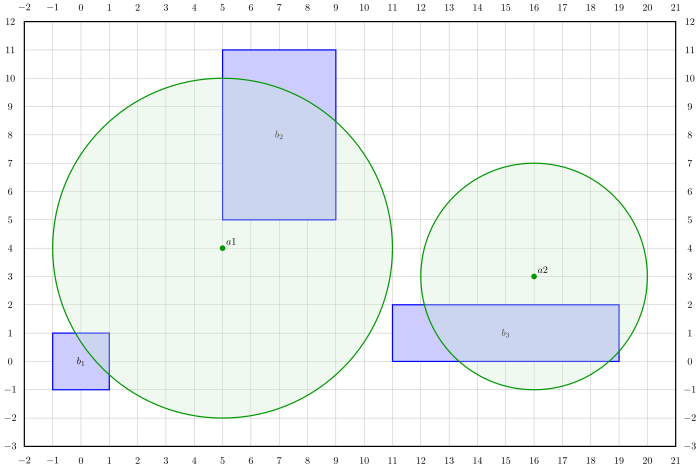

# Travail pratique 1: Mise en place de l'application `kover`

Ce document décrit le travail pratique 1 du cours [INF3135 Construction et
maintenance de logiciels](https://etudier.uqam.ca/cours?sigle=INF3135) au
trimestre d'hiver 2025. Le cours est enseigné par Alexandre Blondin Massé,
chargé de cours au [département d'informatique](http://info.uqam.ca/),
à l'[Université du Québec à Montréal](https://uqam.ca/).

Le travail doit être remis au plus tard le **dimanche 16 février à 23h59**.
À partir de minuit, une pénalité de **2 points** par heure de retard sera
appliquée.

## Objectifs pédagogiques

Les principaux objectifs pédagogiques visés sont les suivants:

- Vous initier au langage de **programmation C**
- Utiliser adéquatement le logiciel de contrôle de versions **Git** pour
  développer une application
- Vous familiariser à la compilation d'un programme à l'aide d'un **Makefile**
  simple
- Vous habituer à décomposer un programme en **petites fonctions**
- Vous familiariser avec le passage d'arguments par **adresse**
- Vous familiariser avec l'utilisation de l'**entrée standard** (`stdin`) et de
  la **sortie standard** (`stdout`)
- Vous familiariser avec le traitement des **arguments** d'un programme et des
  **codes de retour**

## Description du travail

Vous devez concevoir les bases d'une application nommée `kover` qui vise
à optimiser le positionnement d'*antennes* de communication afin de couvrir
adéquatement des *buildings* répartis dans une zone donnée, appelée *scène*.
Cette application sera ensuite étendue dans le cadre des travaux pratiques 2 et
3 du cours.

La scène doit être lue sur l'entrée standard (`stdin`). Le programme affiche
ensuite sur la sortie standard (`stdout`) différentes informations sur la
scène. Votre programme devra avoir un comportement très précis vérifié par des
tests fonctionnels. Vous devrez donc vous assurer de ne pas écrire de messages
superflus sur `stdout` ou `stderr` et de bien écrire **tels quels** les
messages d'erreurs.

Le flux de texte suivant décrit une scène valide composée de trois buildings
(identifiés par `b1`, `b2` et `b3`) et de deux antennes (identifiées par `a1`
et `a2`):

```
begin scene
  building b1 0 0 1 1
  building b2 7 8 2 3
  building b3 15 1 4 1
  antenna a1 5 4 6
  antenna a2 16 3 4
end scene
```

Une représentation graphique de la scène ci-haut est disponible dans le fichier
SVG suivant:



Plus formellement, un *building* est représenté par les éléments suivants:

* `id`: un *identifiant* unique, sous forme de chaîne de caractères;
* `x` et `y`: une *position* $`(x,y)`$ dans le plan, sous forme de deux entiers
  (négatifs, nuls ou positifs);
* `w` et `h`: une *demi-largeur* et une *demi-hauteur* $`(w, h)`$, qui sont
  des entiers strictement positifs.

Ainsi, les 4 points du rectangle déterminé par un building sont $`(x - w,
y - h)`$, $`(x + w, y - h)`$, $`(x - w, y + h)`$ et $`(x + w, y + h)`$.

Une *antenne* est représentée par les éléments suivants:

* `id`: un *identifiant* unique, sous forme de chaîne de caractères;
* `x` et `y`: une *position* $`(x,y)`$ dans le plan, sous forme de deux entiers
  (négatifs, nuls ou positifs);
* `r`: un rayon (ou une *portée*) $`r`$, qui est un entier strictement
  positif.

Ainsi, un *building* ne peut pas avoir une aire nulle et une antenne a toujours
une portée décrivant un disque d'aire strictement positive. Finalement, une
*scène* est représentée par les éléments suivants:

* `buildings`: une collection de buildings qui ne se chevauchent pas,
  c'est-à-dire qu'une scène ne peut contenir deux buildings dont l'intersection
  occupe une aire non nulle.
* `antennas`: une collection d'antennes qui occupent des positions distinctes.

Pour décrire une scène à l'aide d'un flux de texte, on convient d'utiliser une
syntaxe spécifique:

1. La première ligne du texte doit correspondre à l'expression régulière
   étendue (ERE) `^begin scene$`;
2. La dernière ligne du texte doit correspondre à l'ERE `^end scene$`;
3. Chaque ligne entre la première ligne et la dernière ligne doit être une
   ligne de type *building* ou une ligne de type *antenne*;
4. Une ligne de type *building* doit correspondre à l'ERE
   `^[:blank:]*building ID X Y W H[:blank:]*$`,
   où
    * `ID` est l'identifiant du building,
    * (`X`, `Y`) est la position du building, `X` et `Y` étant des nombres
      entiers et
    * (`W`, `H`) est une paire de demi-largeur et demi-hauteur, `W` et `H`
      étant des nombres entiers strictement positifs;
5. Une ligne décrivant une antenne correspondre à l'ERE
   `^[:blank:]*antenna ID X Y R[:blank:]*$`,
   où
    * `ID` est l'identifiant de l'antenne,
    * (`X`, `Y`) est la position de l'antenne, où `X` et `Y` sont des nombres
      entiers et
    * `R` est la portée de l'antenne, qui est un nombre entier strictement
      positif.

Votre programme doit reconnaître les identifiants et les nombres entiers selon
les contraintes suivantes:

* Un *identifiant* est une chaîne de caractères qui a une correspondance
  complète avec l'ERE `[a-zA-Z_][a-zA-Z0-9_]*`;
* Un *entier* est une chaîne de caractères qui a une correspondance complète
  avec l'ERE `0|([-]?[1-9][0-9]*)`;
* Un *entier strictement positif* est une chaîne de caractères qui a une
  correspondance complète avec l'ERE `[1-9][0-9]*`;

Des exemples de scènes valides et invalides sont donnés dans le répertoire
[`examples`](examples).

L'application `kover` permet donc de manipuler des scènes et vise à optimiser
le positionnement d'antennes dans ces scènes afin de couvrir adéquatement les
buildings qui occupent cette scène.

## Sous-commandes

L'application `kover` utilise des *sous-commandes* afin de préciser
l'information qu'on souhaite afficher à propos d'une scène. Pour ce premier
travail pratique, vous devez supporter les 4 sous-commandes suivantes:

1. `kover bounding-box`
2. `kover describe`
3. `kover help`
4. `kover summarize`

## La sous-commande `help`

Lorsque vous lancez le programme avec la sous-commande `help`, un manuel
d'utilisation doit être affiché sur la sortie standard:

```text
$ bin/kover help
Usage: kover SUBCOMMAND
Handles positioning of communication antennas by reading a scene on stdin.

SUBCOMMAND is mandatory and must take one of the following values:
  bounding-box: returns a bounding box of the loaded scene
  describe: describes the loaded scene in details
  help: shows this message
  summarize: summarizes the loaded scene

A scene is a text stream that must satisfy the following syntax:

  1. The first line must be exactly 'begin scene'
  2. The last line must be exactly 'end scene'
  3. Any line between the first and last line must either be a building line
     or an antenna line
  4. A building line has the form 'building ID X Y W H' (with any number of
     blank characters before or after), where
       ID is the building identifier
       X is the x-coordinate of the building
       Y is the y-coordinate of the building
       W is the half-width of the building
       H is the half-height of the building
  5. An antenna line has the form 'antenna ID X Y R' (with any number of
     blank characters before or after), where
       ID is the building identifier
       X is the x-coordinate of the antenna
       Y is the y-coordinate of the antenna
       R is the radius scope of the antenna
```

## La sous-commande `summarize`

La sous-commande `summarize` doit afficher un résumé des éléments qui composent
la scène, c'est-à-dire le nombre de buildings et le nombre d'antennes. Par
exemple, si on reprend la scène illustrée plus haut (voir fichier
[`examples/3b2a.scene`](examples/3b2a.scene)), alors on obtient ceci:

```
$ bin/kover summarize < examples/3b2a.scene
A scene with 3 buildings and 2 antennas
```

La commande affiche en premier le nombre de buildings et ensuite le nombre
d'antennes. Elle doit mettre les noms au pluriel quand il y en a plusieurs. De
plus, elle ne doit afficher que les objets qui apparaissent au moins une fois.

## La sous-commande `describe`

La sous-commande `describe` doit afficher, en plus du résumé, le détail des
éléments qui composent la scène. Toujours en prenant l'exemple ci-haut:

```
$ bin/kover describe < examples/3b2a.scene
A scene with 3 buildings and 2 antennas
  building b1 at 0 0 with dimensions 1 1
  building b2 at 7 8 with dimensions 2 3
  building b3 at 15 1 with dimensions 4 1
  antenna a1 at 5 4 with range 6
  antenna a2 at 16 3 with range 4
```

Les buildings doivent être affichés en premier, suivis des antennes, avec une
indentation de 2 espaces. Les buildings et les antennes doivent apparaître en
suivant l'ordre lexicographique des identifiants.

## La sous-commande `bounding-box`

Finalement, la sous-commande `bounding-box` doit afficher les dimensions du
plus petit rectangle qui contient tous les éléments de la scène, incluant la
portée des antennes.

```
$ bin/kover bounding-box < examples/3b2a.scene
bounding box [-1, 20] x [-2, 11]
```

## Validation

Votre programme doit détecter les erreurs d'utilisation. En particulier,
lorsqu'il s'exécute de façon normale (sans erreur), alors le code `0` doit être
retourné. En cas d'erreur, vous devez retourner le code `1`. Lorsqu'une erreur
survient, un message expliquant l'erreur doit être affiché sur le canal
d'erreur (`stderr`).

1. Si on oublie de fournir une sous-commande, le message suivant doit être
   affiché:

    ```
    error: subcommand is mandatory
    ```

2. Si on fournit une sous-commande non reconnue, le message suivant doit être
   affiché:

    ```
    error: subcommand 'SUBCOMMAND' is not recognized
    ```

   où `SUBCOMMAND` est la sous-commande non reconnue fournie

3. Si la première ligne du flux de texte décrivant la scène n'est pas correcte:

    ```
    error: first line must be exactly 'begin scene'
    ```

4. Si une des lignes entre `begin scene` et `end scene` n'est pas de type
   `building` ou `antenna`:

    ```
    error: unrecognized line (line #N)
    ```

   où `N` est le numéro de la ligne problématique (on commence la numérotation des lignes à 1)

5. Si la dernière ligne du flux de texte décrivant la scène n'est pas correcte:

    ```
    error: last line must be exactly 'end scene'
    ```

6. S'il existe plusieurs buildings avec le même identifiant:

    ```
    error: building identifier ID is non unique
    ```

   où `ID` est l'identifiant qui apparaît plus d'une fois

7. S'il existe des buildings qui se chevauchent (dont l'intersection a une aire
   non vide):

    ```
    error: buildings ID1 and ID2 are overlapping
    ```

   où `ID1` et `ID2` sont les identifiants des buildings qui se chevauchent

8. Si une ligne de type building a le mauvais nombre d'arguments:

    ```
    error: building line has wrong number of arguments (line #N)
    ```

   où `N` est le numéro de la ligne problématique

8. Si une ligne de type building a un identifiant invalide

    ```
    error: invalid identifier "ID" (line #N)
    ```

   où `ID` est l'identifiant problématique et `N` est le numéro de la ligne
   problématique

9. Si une ligne de type building a une valeur `X` ou une valeur `Y` qui n'est
   pas un entier valide:

    ```
    error: invalid integer "VALUE" (line #N)
    ```

   où `VALUE` est la valeur problématique et `N` est le numéro de la ligne
   problématique

10. Si une ligne de type building a une valeur `W` ou une valeur `H` qui n'est
    pas un entier strictement positif valide:

    ```
    error: invalid positive integer "VALUE" (line #N)
    ```

    où `VALUE` est la valeur problématique et `N` est le numéro de la ligne
    problématique

Des erreurs similaires pour les lignes de type antenne doivent également être
considérées. Toutes ces erreurs sont couvertes dans les tests fonctionnels
disponibles dans les fichiers `test*.bats` du répertoire [`bats`](bats). En cas
de doute sur le comportement à adopter dans certaines situations, n'hésitez pas
à poser des questions pour avoir des précisions.

## Hypothèses simplificatrices

Comme il n'est pas permis d'utiliser l'allocation dynamique pour ce travail,
vous pouvez faire certaines hypothèses qui réduisent le nombre de cas d'erreur
potentielle. Ces aspects seront gérés dans le prochain travail pratique. Plus
précisément, vous pouvez supposer que:

* Chaque ligne d'une scène est de longueur au plus 50
* Un identifiant de building ou d'antenne est de longueur au plus 10
* Le nombre maximum de buildings dans une scène est 100
* Le nombre maximum d'antennes dans une scène est 100
* Le nombre maximum d'arguments d'une ligne de scène est 6 (par exemple,
  `building b1 0 0 1 1` a exactement 6 arguments, séparés par des espaces)
* La longueur maximum d'un argument dans une ligne de scène est 10

## Tâches à accomplir

Afin de compléter ce travail pratique, vous devrez suivre les étapes suivantes:

1. Créez un clone (*fork*) du [dépôt du
   projet](https://gitlab.info.uqam.ca/inf31351/20251/inf3135-251-tp1)
2. Assurez-vous que le dépôt soit privé, pour éviter le plagiat
3. Donnez accès à votre dépôt aux utilisateurs `blondin_al` et
   `guite-vinet.julien` en mode *Maintainer* (pour la correction)
4. Familiarisez-vous avec le contenu du dépôt, en étudiant chacun des fichiers
   (`README.md`, `sujet-tp1.md`, répertoire `bats`, `.gitlab-ci.yml`, etc.).
5. Commencez votre développement en versionnant fréquemment l'évolution de
   votre projet avec Git. La qualité de votre versionnement sera évaluée, il
   est donc important de sauvegarder (*commit*) chaque fois que vous avez
   terminé une petite tâche.
6. Complétez le fichier `README.md` en respectant le format Markdown et en
   tenant compte des instructions qui y sont présentes.
7. Complétez le fichier `kover.c`.

### Clone et création du dépôt

Vous devez cloner le dépôt fourni et l'héberger sur la plateforme [Gitlab du
département](https://gitlab.info.uqam.ca/). Votre dépôt devra se nommer
**exactement** `inf3135-251-tp1` et l'URL devra être **exactement**
`https://gitlab.info.uqam.ca/<utilisateur>/inf3135-251-tp1`, où `<utilisateur>`
doit être remplacé par votre nom d'utilisateur. Il devra être **privé** et
accessible seulement par vous et par les utilisateurs `blondin_al` et
`guite-vinet.julien`.

### Fichier `kover.c`

L'organisation du contenu de votre fichier `kover.c` est laissée à votre
discrétion. Des déclarations initiales de constantes et de structures sont
fournies afin de vous aider à vous organiser, mais il est permis de les
modifier ou de les supprimer si vous préférez travailler différemment.

### Makefile

Des Makefiles sont fournis afin d'automatiser certaines tâches. Normalement,
vous ne devriez pas avoir besoin de les modifier, mais vous pouvez le faire si
vous souhaitez automatiser d'autres tâches.

### Tests fonctionnels

Vous pouvez en tout temps lancer les tests fonctionnels à l'aide de la commande

```sh
$ make test
```

Initialement, tous les tests non fonctionnels sont désactivés avec la commande
`skip`. Au fur et à mesure que vous progressez dans votre travail, vous pouvez
activer les tests en supprimant la ligne `skip`. Notez qu'il n'est pas permis
de modifier les tests fonctionnels (sauf en supprimant les lignes `skip` pour
activer les tests qui réussissent).

### Fichier `README.md`

Vous devez compléter le fichier `README.md` livré dans le dépôt en suivant les
instructions qui y sont indiquées. Assurez-vous également de répondre aux
questions suivantes:

- À quoi sert votre programme?
- Comment le compiler?
- Comment l'exécuter?
- Quels sont les formats d'entrées et de sorties?
- Quels sont les cas d'erreur gérés?

Vous devez utiliser la syntaxe Markdown pour écrire une documentation claire et
lisible. Vous pouvez en tout temps vérifier localement le fichier HTML produit
sur votre machine à l'aide de [Pandoc](https://pandoc.org/), mais il est aussi
conseillé de vérifier, avant la remise finale, que le résultat produit sur la
page d'accueil de GitLab est celui auquel vous vous attendez.

Il est acceptable de recopier tels quels des passages du fichier `sujet.md`
dans le fichier `README.md` que vous remettrez.

Évitez d'abuser du gras, de l'italique et du HTML brut dans le fichier
`README.md`. Exploitez au maximum les listes à puces et formatez les noms de
fichier et le code à l'aide des apostrophes inversés. Finalement, soignez la
qualité de la langue, qui sera prise en considération dans le fichier
`README.md`.

### Git

Il est important de suivre l'évolution de votre projet à l'aide de Git. Vous
devez cloner (à l'aide du bouton *fork*) le gabarit du projet fourni et ajouter
vos modifications à l'aide de *commits*. En particulier, il est possible que
j'apporte des corrections ultérieures à l'énoncé que vous pourrez récupérer
facilement si nous avons un historique **commun**.

N'oubliez pas de bien configurer correctement votre fichier `.gitconfig` qui
permet de vous identifier comme auteur de *commits*, en y indiquant vos
**véritables** prénom, nom et courriel.

Les messages de *commit* doivent suivre [la convention de Chris
Beams](https://chris.beams.io/posts/git-commit/), adaptée au français:

1. Séparer le sujet (la première ligne) du corps (le reste du message) par une
   ligne vide
2. Limiter le sujet à 50 caractères
3. Commencer le message par une lettre majuscule
4. Ne pas terminer le sujet avec un point
5. Utiliser un verbe à l'indicatif présent comme premier mot du sujet
6. Limiter les lignes du corps du message à 72 caractères
7. Utiliser le corps pour expliquer *ce que* (*what*) la modification apporte
   et *pourquoi* (*why*) elle apporte cette modification, plutôt que *comment*
   (*how*) elle apporte une modification

Vous pouvez vous inspirer des messages de *commit* utilisés dans tous les
dépôts partagés par l'enseignant dans le cadre du cours.

Finalement, n'oubliez pas d'inclure un fichier `.gitignore` en fonction de
votre environnement de développement. Aussi, assurez-vous de ne pas versionner
de fichiers inutiles (les fichiers binaires, entre autres, mais pas seulement).

### Langue

Comme vous l'avez constaté, le projet est développé dans deux langues, soit le
français et l'anglais. C'est une réalité avec laquelle vous allez peut-être
devoir composer dans votre future carrière. Dans le cadre de ce travail
pratique, vous devez suivre les règles suivantes:

* Tous les messages de *commit* doivent être rédigés en français
* Le fichier `README.md` doit être rédigé en français
* Les commentaires et la documentation du code source (fichier `.c`, fichier
  `.bats`, etc.) doivent être rédigés en anglais

Cette convention n'est pas universelle, mais elle est souvent employée dans les
milieux bilingues.

### Correction

L'exécution de votre programme sera vérifiée automatiquement grâce à une suite
de tests rédigée en [Bats](https://github.com/bats-core/bats-core). Vous n'avez
pas à installer Bats, qui est livré dans ce dépôt dans le répertoire `bats`.
Pour faciliter votre développement, vous avez accès à un certain nombre de
tests *publics* pour corriger vos travaux (aussi disponibles dans le répertoire
`bats`, dans les fichiers de la forme `test*.bats`). Il suffit d'entrer la
commande

```sh
$ make test
```

pour lancer la suite de tests.

Cependant, prenez note que la couverture de tests n'est pas **complète**. Des
tests seront ajoutés lors de la correction finale. Si vous avez un doute sur le
comportement attendu d'une certaine situation, c'est votre responsabilité de
poser des questions pour obtenir des précisions.

### Barème

Les critères d'évaluation sont les suivants:

| Critère             |  Points |
|:--------------------|--------:|
| Fonctionnalité      |     /80 |
| Qualité du code     |     /20 |
| Documentation       |     /20 |
| Utilisation de Git  |     /10 |
| Total               |    /130 |

Plus précisément, les éléments suivants seront pris en compte:

- **Fonctionnalité (80 points)**: Le programme passe les tests *publics* et
  *privés* en affichant le résultat attendu (1 point par test).

- **Qualité du code (20 points)**: Les identifiants utilisés sont significatifs
  et ont une syntaxe uniforme, le code est bien indenté, il y a de l'aération
  autour des opérateurs et des parenthèses, le programme est simple et lisible.
  Pas de bout de code en commentaire ou de commentaires inutiles. Pas de valeur
  magique répétées. Le code doit être bien factorisé (pas de redondance). Il
  est décomposé en petites fonctions qui effectuent des tâches spécifiques. La
  présentation est soignée. *Note*: si votre style est impeccable mais que
  votre travail est peu avancé, vous aurez peu de points pour cette partie.

- **Documentation (20 points)**: Le fichier `README.md` est complet et respecte
  le format Markdown. Toutes les fonctions sans exception ont une *docstring*
  qui suit le format suggéré en classe.

- **Utilisation de Git (10 points)**: Les modifications sont réparties en
  *commits* atomiques. Le fichier `.gitignore` est complet. Les messages de
  *commit* sont significatifs, uniformes et suivent la convention suggérée.

### Pénalités

Si votre programme ne compile pas, une pénalité pouvant aller jusqu'à **100%**
pourra être appliquée.

En outre, si vous ne respectez pas les critères suivants, une pénalité
pouvant aller jusqu'à **50%** pourra être appliquée:

- Votre code permanent doit être indiqué dans le fichier `README.md`
- Votre dépôt doit se nommer **exactement** `inf3135-251-tp1`
- L'URL de votre dépôt doit être **exactement**
  `https://gitlab.info.uqam.ca/<utilisateur>/inf3135-251-tp1` où
  `<utilisateur>` doit être remplacé par votre identifiant
- Les utilisateurs `blondin_al` et `guite-vinet.julien` doivent avoir accès
  à votre projet en mode *Maintainer*.
- Votre dépôt doit être un *fork* du [gabarit
  fourni](https://gitlab.info.uqam.ca/inf31351/20251/inf3135-251-tp1).
- Votre dépôt doit être **privé**.
- Il est interdit d'utiliser l'**allocation dynamique** dans ce travail
  (fonctions `malloc`, `calloc`, `realloc`, `free`).

## Remise

La remise se fait automatiquement en ajoutant les utilisateurs `blondin_al` et
`guite-vinet.julien` en mode *Maintainer*, vous n'avez rien de plus à faire.
À moins d'indication contraire de votre part, ce sera le dernier (*commit*)
disponible sur votre branche `master` qui sera considéré pour la correction.

Le travail doit être remis au plus tard le **dimanche 16 février à 23h59**.
À partir de minuit, une pénalité de **2 points** par heure de retard sera
appliquée.
